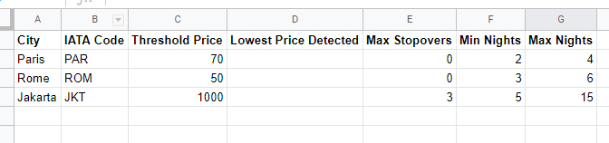

# Fligh deals searcher
Searches for cheap flights using kiwi.com API. The search looks for cheapest flight to each destination from input google sheet. If a flight is found mail notification is sent. 
Sheety.co service is used to read and update the input Google sheet.

## Input file 
The input google sheet must have the following structure. Names of columns must be followed exactly.


To create your own sheet copy example from https://docs.google.com/spreadsheets/d/1GbH1xCGDaukOzvwV3PI39jBP4fqw2KzKGHFUJSinfMw

### Note
- Searcher updates the Lowest Price Detected column regularly.
- IATA Code values are optional, searcher updates the value if it is left empty.
- All other column`s **values are required** .

The sheet must be added to your sheety project (At sheety.co choose new project from google sheet).  GET, PUT methods must be enabled.

## Environement variables
Searcher uses .env file which you must create on your own with following content:

```
SHEETY_TOKEN=[YOUR VALUE]
KIWI_API_KEY=[YOUR VALUE]
NOTIFICATION_MAILBOX=[YOUR VALUE]
MAIL_PASSWORD=[YOUR VALUE]
PERSONAL_MAILBOX=[YOUR VALUE]
```
